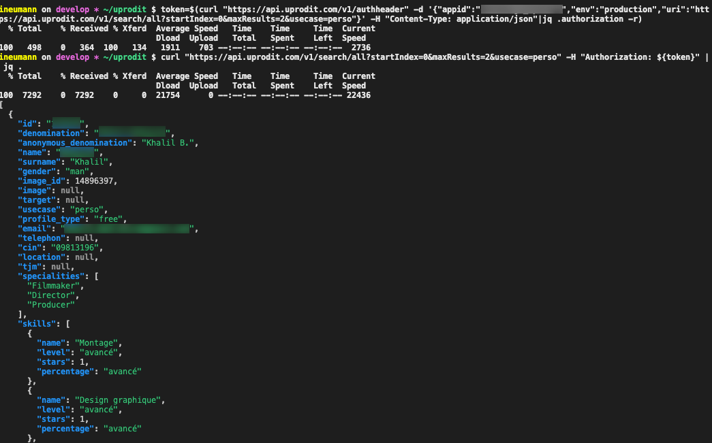

# How to consume our API

## Objectives

This documentation aims to provide all the knowledge allowing to consume the uprodit's webservices by external consumers (a mobile application for example).

## Insights about the RESTful architecture

The implemented architecture is a distributed architecture known as "RESTful". It means that uprodit is providing "REST webservices" (for "Representational State Transfer").

It is a style of architecture based on webservices using the following principles:

* The format of resources (business data) with the semantics of data description languages ​​such as XML or JSON
* Some HTTP protocol directives that identify the operations which will be performed by the called webservice:
  * `POST` for creating and persisting a resource in database (or other persistent support)
  * `PUT` for updating a resource in database (or other persistent support)
  * `PATCH` for partial updating partielle of a resource in database (or other persistent support)
  * `GET` for searching and reading a resource in database (or other persistent support)
  * `DELETE` for removing a resource from the database (or other persistent support)
* Quelques codes retours du protocole HTTP qui permettent de détecter la bonne exécution d'un webservice REST ou bien d'identifier le type d'erreur rencontrée :
  * `200`: successful reception of a resource (`GET`)
  * `201`: successful persistence of a resource (`PUT`/`POST`)
  * `204`: no content (it could mean that a `DELETE` or `PUT` were sucessfuly executed or that the resource is not existing in the case of a `GET` requests, like `404` return code)
  * `400`: invalid parameters (`GET`/`PUT`/`POST`/`DELETE`)
  * `401`: authentication issue (`GET`/`PUT`/`POST`/`DELETE`)
  * `403`: forbidden, access rights issue (`GET`/`PUT`/`POST`/`DELETE`)
  * `404`: the resources or restful endpoint not exists (`GET`/`PUT`/`POST`/`DELETE`)
  * `50X`: technical errors on the server-side (`GET`/`PUT`/`POST`/`DELETE`)
* L'URI qui possède une signification importante pour l'appel d'un service : celle de permettre, par une simple lecture visuelle, d'identifier le service auquel on fait appel, voire dans le cas d'un appel de type GET, la ressource à récupérer.

## Contrats d'interface

Vous trouverez le fichier WADL de notre API ici: https://api.uprodit.com

Vous trouverez également la définition des endpoints [ici](./api_endpoints.md).

Ce fichier fournis la structure des objets consommés et retournés par les différents Webservices (ces objets doivent être sérialisés/désérialisés en JSON).

Vous pouvez utiliser le plugin Maven de CXF : [wadl2java](http://cxf.apache.org/docs/jaxrs-services-description.html#JAXRSServicesDescription-wadl2javaMavenplugin) pour construire les objets en question.

Nous envisageons dans le future de migrer vers Swagger. Vous avez aussi des [collections postman](./postman/README.md) à disposition.

## Authentification aux webservices de l'API

### Authentication d'une application

La quasi-totalité des webservices sont authentifiés par application (il faut faire une demande d'ajout d'un `appid` aux équipes de uprodit.com pour pouvoir y accéder).

La solution mise en oeuvre est la signature HMAC avec : https://ws-cxf-ext.github.io/ws-cxf-ext/

Pour celles et ceux qui veulent utiliser la partie client de cette solution : https://gitlab.comwork.io/oss/ws-cxf-ext/-/blob/master/docs/getting-started.md#declaring-clients

Pour les autres consommateurs, passer les paramètres suivants dans un paramètre header "Authorization":

* `auth_consumer_key` : chiffrage hmac / sha1 de l'environnement avec l'`appid` ;
* `auth_callback` : url du webservice avec paramètres ;
* `auth_nonce` : token généré aléatoirement (`UUID.randomUUID().toString()`) chiffré en hmac / sha1 via l'`appid` ;
* `auth_token` : token généré aléatoirement (pas le même que auth_nonce)
* `auth_signature` : concaténation de l'uri et du token (`auth_token`) chiffrage via la l'`appid` ;
* `auth_timestamp` : timestamp
* `auth_signature_method` : toujours "HMAC-SHA1"

Ces paramètres sont concaténés sous la forme :

```
Auth auth_consumer_key=valeur&auth_callback=valeur&...
```

Voici un exemple de fonction en javascript pour générer la signature :

```javascript
const hmacsha1 = require('hmacsha1');
const uuid = require('uuid');

function generateSignature(appid, env, uri) {
  auth_signature_method = 'HMAC-SHA1';
  auth_consumer_key = encodeURIComponent(hmacsha1(appid, env));
  auth_token = uuid.v4();
  uri_path = uri.replace(new RegExp('http(s)?://[^/]*'), '')
  auth_signature = encodeURIComponent(hmacsha1(appid, uri_path + auth_token));
  auth_nonce = encodeURIComponent(hmacsha1(appid, uuid.v4()));
  auth_callback = encodeURIComponent(uri_path);
  auth_timestamp = new Date().getTime();

  return `Auth ?auth_signature=${auth_signature}&auth_nonce=${auth_nonce}&auth_callback=${auth_callback}&auth_timestamp=${auth_timestamp}&auth_token=${auth_token}&auth_signature_method=${auth_signature_method}&auth_consumer_key=${auth_consumer_key}`;
}

console.log(generateSignature("challenge_uprodit", "production", "https://api.uprodit.com/v2/profile/personal/en/51"));
```

Les dépendances à installer pour faire tourner ce code (avec node.js ou autre runtime JS) :

```shell
npm init
npm install hmacsha1 --save
npm install uuid --save
```

La même chose en typescript (pour une application en React) :

```typescript
import hmacsha1 from 'hmacsha1'
import { v4 } from 'uuid'

const generateSignature = (appid, env, uri) => {
    var auth_signature_method = 'HMAC-SHA1';
    var auth_consumer_key = encodeURIComponent(hmacsha1(appid, env));
    var auth_token = v4();
    var uri_path = uri.replace(new RegExp('http(s)?://[^/]*'), '')
    var auth_signature = encodeURIComponent(hmacsha1(appid, uri_path + auth_token));
    var auth_nonce = encodeURIComponent(hmacsha1(appid, v4()));
    var auth_callback = encodeURIComponent(uri_path);
    var auth_timestamp = new Date().getTime();
  
    return `Auth ?auth_signature=${auth_signature}&auth_nonce=${auth_nonce}&auth_callback=${auth_callback}&auth_timestamp=${auth_timestamp}&auth_token=${auth_token}&auth_signature_method=${auth_signature_method}&auth_consumer_key=${auth_consumer_key}`;
}

export default generateSignature;
```

Il enfin également possible de générer le header via l'api [`/v1/authheader`](https://api.uprodit.com):

```shell
$ curl "https://api.uprodit.com/v1/authheader" -d '{"appid":"XXXXXXX","env":"YYYY","uri":"https://api.uprodit.com/v1/search/all?startIndex=0&maxResults=10&usecase=perso"}' -H "Content-Type: application/json"
{"authorization":"Auth ?auth_signature=CQtP0y0VdeZ%2FQz%2FpCXmO4sddsdleTKI%3D&auth_nonce=vYGxnKbLFPxsdlsdksl8kg9XX%2BPQ6X2c%3D&auth_callback=%2Fv1%2Fsearch%2Fall&auth_timestamp=1638971145860&auth_token=0c5bdc20-daca-4f8e-81c3-e0f65591927e&auth_signature_method=HMAC-SHA1&auth_consumer_key=11aqkYrxIy7pqsfkslqfklsp1JSZUsdsd%3D"}
```

Il faudra passer cette valeur dans le header `Authorization` du webservice que l'on souhaite appeler (qui correspond à l'uri passé dans le body). Cette solution est adaptée pour faire des tests rapides mais n'est pas recommandée en production car vous serez obligé de faire une double quantité d'appels (car pour chaque appel la signature est différente). Il vaut mieux avoir implémenté localement le code qui vous permet de générer la signature à partir de l'`appid` (donc reprendre la lib java ws-cxf-ext ou le code javascript précédent ou encore ré-implémenter la même chose dans le langage que vous utilisez).

Petit hack si vous faite vos appels en shell scripts, vous pouvez utiliser `jq` pour récupérer directement la valeur du token dans une variable comme ceci:

```shell
authorization=$(curl "https://api.uprodit.com/v1/authheader" -d '{"appid":"challenge_uprodit","env":"production","uri":"https://api.uprodit.com/v2/profile/personal/en/51"}' -H "Content-Type: application/json" 2>/dev/null|jq .authorization -r)
```

Puis directement consommer le webservice comme ceci:

```shell
curl -H "Authorization: ${authorization}" "https://api.uprodit.com/v2/profile/personal/en/51" 2>/dev/null | jq .
```

Exemple de requête de recherche:



### Authentification d'un utilisateur

Un grand nombre d'API demandent un contrôle de droits des utilisateurs soit via les headers suivants :

* `x-uprodit-username`: email de l'utilisateur
* `x-uprodit-password`: password de l'utilisateur

Soit le header `x-uprodit-token`: il s'agit d'un token ayant une validité de 30 jours, généré avec l'api [`/v1/token`](https://api.uprodit.com) de la façon suivante:

```shell
$ authorization=$(curl "https://api.uprodit.com/v1/authheader" -d '{"appid":"challenge_uprodit","env":"production","uri":"https://api.uprodit.com/v1/token"}' -H "Content-Type: application/json" 2>/dev/null|jq .authorization -r)
$ curl -X POST https://api.uprodit.com/v1/token -H "Authorization: ${authorization}" -H "Content-Type: application/json" -d '{"username":"someone@uprodit.com","password":"changeit"}'
{"token": "TOKEN_BASE64_VALUE"}
```

De la même façon, si vous faite du shell, petit hack avec `jq` pour récupérer les valeurs plus vite:

```shell
$ authorization=$(curl "https://api.uprodit.com/v1/authheader" -d '{"appid":"challenge_uprodit","env":"production","uri":"https://api.uprodit.com/v1/token"}' -H "Content-Type: application/json" 2>/dev/null|jq .authorization -r)
$ token=$(curl -X POST https://api.uprodit.com/v1/token -H "Authorization: ${authorization}" -H "Content-Type: application/json" -d '{"username":"idriss.neumann@comwork.io","password":"mypassword"}' 2>/dev/null|jq .token -r)
$ authorization=$(curl "https://api.uprodit.com/v1/authheader" -d '{"appid":"challenge_uprodit","env":"production","uri":"https://api.uprodit.com/v1/user/1"}' -H "Content-Type: application/json" 2>/dev/null|jq .authorization -r)
$ curl -H "Authorization: ${authorization}" -H "x-uprodit-token: ${token}" "https://api.uprodit.com/v1/user/1" -v
```

Pour éviter toute compromission, nous vous recommandons fortement d'utiliser ce token et de n'envoyer votre mot de passe qu'une fois que vous arrivez à expiration (vous aurez des erreurs 401 qui vous indiqueront qu'il faut de nouveau faire un `POST` sur l'api [`/v1/token`](https://api.uprodit.com)).

