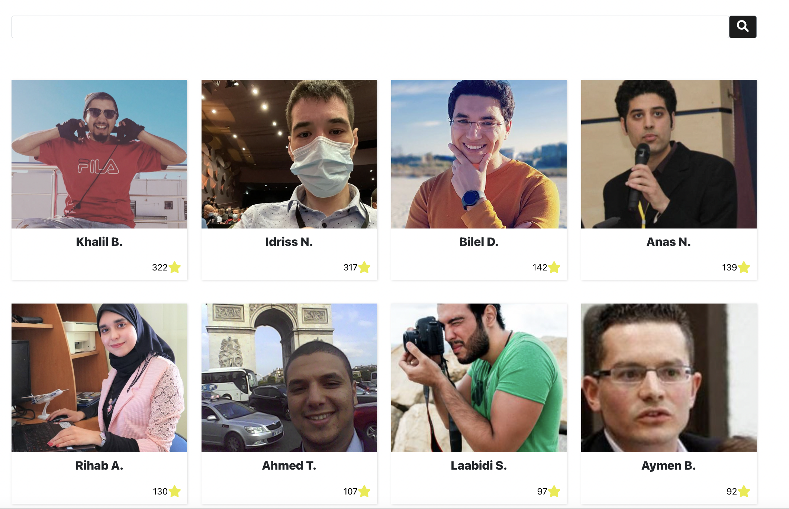

# Uprodit challenge

We're often looking for new talents who can contribute to our projects and also gives-us feedback on our APIs, that's why we're providing this challenge: replicate the [search engine of uprodit](https://www.uprodit.com/profile/all/search/perso)! 

This is what it looks like:

## Instructions

* Deliver a SPA (for "Single Page Application") using a client-side JS framework like Angular, React, Svelte or Vue.JS
* Push your code in a public git repo with an opensource licence (MIT, Apache 2.0, GPL, whatever). You can use any public git provider you want like [github](https://github.com), [gitlab](https://gitlab.com) or [bitbucket](https://bitbucket.org)
* Auto-deploy your application in a PaaS like [Heroku](https://www.heroku.com) or [Netlify](https://www.netlify.com) or any hosting cloud provider (you have to provide us an available https url)
* Provide a production optimized `Dockerfile` for running your application in a container (which can be run everywhere) and a `docker-compose.yml` for making the build and run locally easier. We got [this workshop](https://gitlab.comwork.io/comwork_public/training/docker) (in French) that can help you achieving this part
* Provide insights in the `README.md` file on how locally build and run your application with screenshots

There's no great efforts expected on the design, something in this style is enough:

If you want to make a beautiful design, it's always appreciated! But we'll most analyze your ability to integrate and use our API.

Send the public URL and the git repository url to the `challenge@comwork.io` email address. Do not hesitate to ask help or send us what you achieved even if you didn't finished everything, even if it's not working well. The most important thing for us is reading your code and see your understanding. 

You also can checkout [this page](./community.md) in order to get in touch with the team and get help or contribute if you want.

## Restful endpoints to use

Here's the interfaces (wadl file): [api.uprodit.com](https://api.uprodit.com):

The restful endpoint to use are the following:
* `/v1/search/all`: multi-criteria research endpoint (with the `terms` multi-valued query parameter)
* `/v2/profile/picture/f/{id}`: getting the picture profiles in base64 (the `id` parameter corresponds to the `image_id` field in the results provided by the previous endpoint)

The `appid` to use in order to be authenticated is `challenge_uprodit`, the environment is `production` and the usecase `perso`. You'll find more details on how to consume our API [here](./api/README.md).
