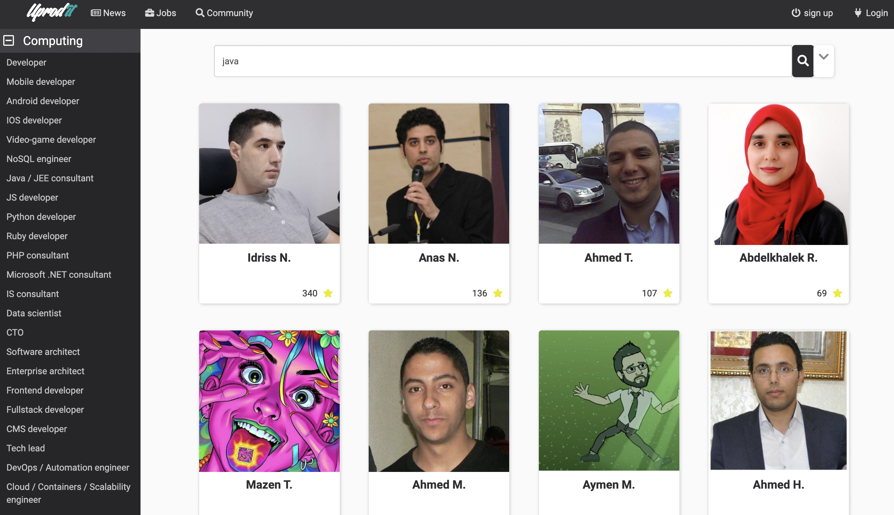

# Challenge uprodit

## Table des matières

[[_TOC_]]

## Travail à faire

Reproduire le moteur de recherche de uprodit.com: https://www.uprodit.com/profile/all/search/perso

Voici à quoi il ressemble:

## Consignes

* Technologie frontend de type SPA : Angular, React ou Vue.JS ou bien une application mobile
* Pusher la solution sur un repo publique sur [github](https://github.com), [gitlab](https://gitlab.com) ou [bitbucket](https://bitbucket.org).
* Déployer l'application sur un cloud tel que [Heroku](https://www.heroku.com) ou [Netlify](https://www.netlify.com) ou autre hébergeur de votre choix (il faut une URL en https)
* Donnez des indications dans le fichier `README.md` de comment builder votre application en local avec des captures d'écran. S'il s'agit d'une application mobile, pushez aussi le fichier .apk compilé. Pour une application web, un `docker-compose.yml` sera grandement apprécié pour faciliter le démarrage sans installation des dépendances
* Envoyer les liens à l'adresse `challenge@comwork.io` (faites le maximum, n'hésitez pas à nous envoyer votre repo même si vous n'avez pas pu faire les partie docker ou hébergement)

## Api à utiliser

Pour cela vous pouvez utiliser l'une de ces deux APIs au choix:

* [api.uprodit.com](https://api.uprodit.com) : api authentifiée avec la méthode `/v1/search/all` (les profils saisis dans plusieurs langues sont déjà regroupés en fonction de la langue de recherche)

L'appid à utiliser est `challenge_uprodit`. Vous trouverez plus de détails sur comment consommer cette API dans [cette documentation](./uprodit_api.md)

* [search.uprodit.com](https://search.uprodit.com) : api publique de recherche avec la méthode `/v1/personalProfile/all` (les informations des profils saisis dans plusieurs langues ne sont pas aggrégés en un seul résultat contrairement à la méthode précédente)

