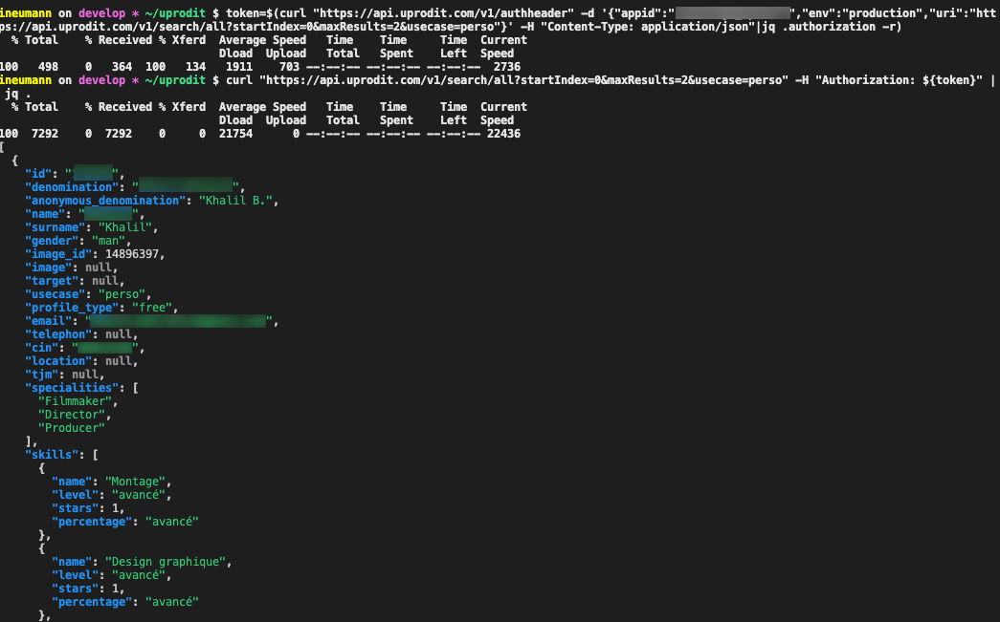

# API uprodit : Consommation des webservices

## Table des matières

[[_TOC_]]

## Objectifs de cette documentation

Cette documentation vise à fournir tout les éléments permettant de consommer les webservices de uprodit par des pilotes externes (application android par exemple).

## Rappel architecture RESTful

L'architecture implémentée au sein du projet "uprodit" est une architecture distribuée dite "RESTful", c'est à dire qui utilise des webservices REST (pour "REpresentational State Transfert").

Il s'agit d'un style d'architecture basé sur des services web utilisant les technologies suivantes :

* Le format des ressources (données métier comme les dossiers de commandes ou autres) grâce aux sémantiques des langages de description de données tels que XML ou JSON.
* Quelques directives du protocole HTTP qui permettent d'identifier les opérations à exécuter par le service appelé. Il s'agit des directives suivantes :
  * POST pour la création d’une ressource en base (ou autre support de persistance) ;
  * PUT pour la modification d’une ressource en base (ou autre support de persistance) ;
  * GET pour la récupération de ressources archivées en base ou autre support de persistance ;
  * DELETE pour la suppression de ressources persistées en base où sur d'autres supports.
* Quelques codes retours du protocole HTTP qui permettent de détecter la bonne exécution d'un webservice REST ou bien d'identifier le type d'erreur rencontrée :
  * 200 : bonne réception d'une ressource (GET)
  * 201 : bonne persistance d'une ressource (PUT/POST)
  * 204 : ressource non trouvée (GET)
  * 400 : paramètres de la requête invalide (GET/PUT/POST/DELETE)
  * 401 : problème d'authentification du consommateur (GET/PUT/POST/DELETE)
  * 403 : problèmes de droits d'accès (GET/PUT/POST/DELETE)
  * 404 : service inexistant  (GET/PUT/POST/DELETE)
  * 500 : erreur technique (GET/PUT/POST/DELETE)
* L'URI qui possède une signification importante pour l'appel d'un service : celle de permettre, par une simple lecture visuelle, d'identifier le service auquel on fait appel, voire dans le cas d'un appel de type GET, la ressource à récupérer.

## Fournisseurs de service (silos)

Les fournisseurs de services sont les suivants :

* Prodit-ws : https://api.uprodit.com (principal fournisseur)
* Prodit-se : https://search.uprodit.com (composant d'intégration avec Elasticsearch, uniquement pour les recherches de profils)

## Authentification aux webservices de l'API

### Authentication d'une application

La quasi-totalité des webservices sont authentifiés par application (il faut faire une demande d'ajout d'un `appid` aux équipes de uprodit.com pour pouvoir y accéder).

La solution mise en oeuvre : http://ws-cxf-ext.github.io/ws-cxf-ext/

Pour celles et ceux qui veulent utiliser la partie client de cette solution : https://github.com/ws-cxf-ext/ws-cxf-ext/wiki/Getting-started#spring-server-configuration

Pour les autres consommateurs, passer les paramètres suivants dans un paramètre header "Authorization":

* `auth_consumer_key` : chiffrage hmac / sha1 de l'environnement avec l'`appid` ;
* `auth_callback` : url du webservice avec paramètres ;
* `auth_nonce` : token généré aléatoirement (`UUID.randomUUID().toString()`) chiffré en hmac / sha1 via l'`appid` ;
* `auth_token` : token généré aléatoirement (pas la même que auth_nonce)
* `auth_signature` : concaténation de l'uri et du token (`auth_token`) chiffrage via la l'`appid` ;
* `auth_timestamp` : timestamp
* `auth_signature_method` : toujours "HMAC-SHA1"

Ces paramètres sont concaténés sous la forme :

```
Auth auth_consumer_key=valeur&auth_callback=valeur&...
```

Il enfin également possible de générer le header via l'api [`/v1/authheader`](https://api.uprodit.com):

```shell
$ curl "https://api.uprodit.com/v1/authheader" -d '{"appid":"XXXXXXX","env":"YYYY","uri":"https://api.uprodit.com/v1/search/all?startIndex=0&maxResults=10&usecase=perso"}' -H "Content-Type: application/json"
{"authorization":"Auth ?auth_signature=CQtP0y0VdeZ%2FQz%2FpCXmO4sddsdleTKI%3D&auth_nonce=vYGxnKbLFPxsdlsdksl8kg9XX%2BPQ6X2c%3D&auth_callback=%2Fv1%2Fsearch%2Fall&auth_timestamp=1638971145860&auth_token=0c5bdc20-daca-4f8e-81c3-e0f65591927e&auth_signature_method=HMAC-SHA1&auth_consumer_key=11aqkYrxIy7pqsfkslqfklsp1JSZUsdsd%3D"}
```

Il faudra passer cette valeur dans le header `Authorization` du webservice que l'on souhaite appeler (qui correspond à l'uri passé dans le body). Cette solution est adaptée pour faire des tests rapides mais n'est pas recommandé en production car vous serez obligé de faire une double quantité d'appels (car pour chaque appel la signature est différente). Il vaut mieux avoir localement le code qui vous permet de générer la signature à partir de l'`appid`.

Petit hack si vous faite vos appels en shell scripts, vous pouvez utiliser `jq` pour récupérer directement la valeur du token dans une variable comme ceci:

```shell
token=$(curl "https://api.uprodit.com/v1/authheader" -d '{"appid":"challenge_uprodit","env":"production","uri":"https://api.uprodit.com/v2/profile/personal/en/51"}' -H "Content-Type: application/json"|jq .authorization -r)
```

Puis directement consommer le webservice comme ceci:

```shell
curl -H "Authorization: ${token}" "https://api.uprodit.com/v2/profile/personal/en/51"
```

Exemple de requête de recherche:



### Authentification d'un utilisateur

Un grand nombre d'API demandent un contrôle de droits des utilisateurs soit via les headers suivants :

* `x-uprodit-username`: email de l'utilisateur
* `x-uprodit-password`: password de l'utilisateur hashé en bcrypt

Soit le header `x-uprodit-token`: il s'agit d'un token ayant une validité de 30 jours, généré avec l'api [`/v1/token`](https://api.uprodit.com) de la façon suivante:

```shell
$ token=$(curl "https://api.uprodit.com/v1/authheader" -d '{"appid":"challenge_uprodit","env":"production","uri":"https://api.uprodit.com/v1/token"}' -H "Content-Type: application/json"|jq .authorization -r)
$ curl -X POST https://api.uprodit.com/v1/token -H "Authorization: ${token}" -H "Content-Type: application/json" -d '{"username":"someone@uprodit.com","password":"changeit"}'
{"token": "TOKEN_BASE64_VALUE"}
```

De la même façon, si vous faite du shell, petit hack avec `jq` pour récupérer les valeurs plus vite:

```shell
$ token=$(curl "https://api.uprodit.com/v1/authheader" -d '{"appid":"challenge_uprodit","env":"production","uri":"https://api.uprodit.com/v1/token"}' -H "Content-Type: application/json"|jq .authorization -r)
$ uprodit_token=$(curl -X POST https://api.uprodit.com/v1/token -H "Authorization: ${token}" -H "Content-Type: application/json" -d '{"username":"idriss.neumann@comwork.io","password":"mypassword"}'|jq .token -r)
$ token=$(curl "https://api.uprodit.com/v1/authheader" -d '{"appid":"challenge_uprodit","env":"production","uri":"https://api.uprodit.com/v1/user/1"}' -H "Content-Type: application/json"|jq .authorization -r)
$ curl -H "Authorization: ${token}" -H "x-uprodit-token: ${uprodit_token}" "https://api.uprodit.com/v1/user/1" -v
```

Pour éviter toute compromission, nous vous recommandons fortement d'utiliser ce token et de n'envoyer votre mot de passe qu'une fois que vous arrivez à expiration (vous aurez des erreurs 401 qui vous indiqueront qu'il faut de nouveau faire un `POST` sur l'api [`/v1/token`](https://api.uprodit.com)).

## Contrats d'interfaces

Les documentations et WADL est disponible ici : 
* [API](https://api.uprodit.com)
* [SEARCH](https://search.uprodit.com)

Ces fichiers fournissent la structure des objets consommés et retournés par les différents Webservices (ces objets doivent être sérialisés/désérialisés en JSON).
Vous pouvez utiliser le plugin Maven de CXF : [wadl2java](http://cxf.apache.org/docs/jaxrs-services-description.html#JAXRSServicesDescription-wadl2javaMavenplugin) pour construire les objets en question
